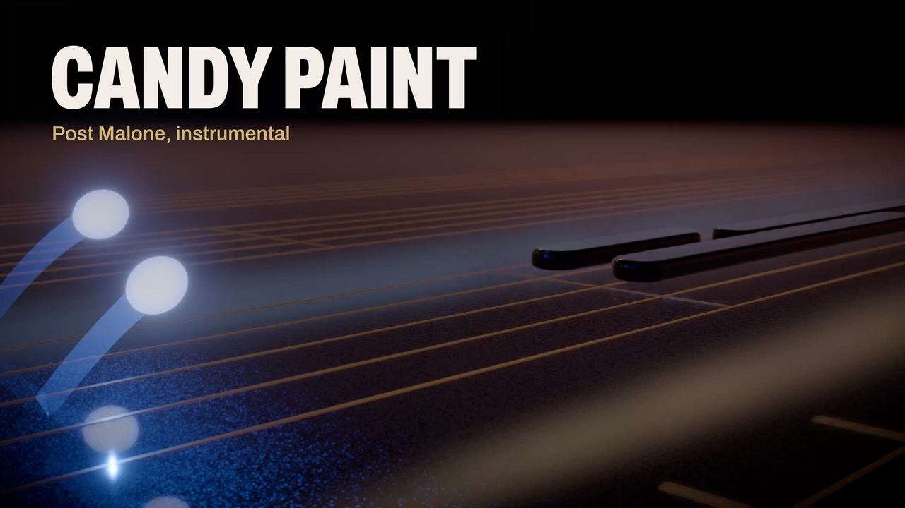

# Candy Paint

> A music video for a piano cover of Post Malone's "Candy Paint", rendered note by note from the score.

**[Watch on YouTube](https://www.youtube.com/watch?v=e-R5cXF3bzE)** · **[Play it live in your browser](https://candy-paint.vercel.app)** · **[Read the write-up](https://www.transitivebullsh.it/projects/candy-paint-music-video)**

Every voice in the arrangement gets a small performer that travels the score and lands on each note exactly as it sounds. No generative video or imagery: a purpose-built WebGL engine renders every frame deterministically from a transcription of the song.

Status: the full video is rendered in Direction A, Candy Lacquer: performers that split for chords and held notes, a storyboarded camera, and end credits. A 9:16 cut for Instagram and TikTok has its own camera, and an interactive web player renders the whole video live in the browser.

## License

The code is [MIT](license) © [Travis Fischer](https://x.com/transitive_bs). The song and the cover recording are not included. Anything derived from them, including the transcribed score in `data/score.json` and renders with audio, is not covered by this license.

---

Want to run it, change it, or see where everything lives? See [contributing.md](contributing.md).
